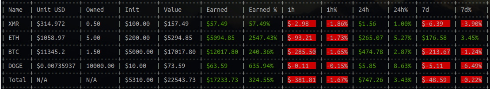
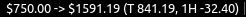

# DEPRACATED

The version of the Coinmarketcap API used by this application is offline

# cmk

Track cryptocurrency portfolio


## Usage

```
USAGE:
    cmk [FLAGS] [OPTIONS] <FILE>

FLAGS:
    -s, --summary    Summary only
    -t, --table      Print table
    -h, --help       Prints help information
    -V, --version    Prints version information

OPTIONS:
    -f, --format <FORMAT>    Custom format
    -l, --limit <LIMIT>      Queried currency limit (Default: 150)
    -p, --proxy <PROXY>      Proxy URL

ARGS:
    <FILE>    Portfolio JSON File
```

## Table Option

Use -t option for a table output:




## With i3blocks

Use the -s option for a summary line that is suitable to use with i3blocks, use -f to customize the format:


```
[cmk]
command=cmk ~/sample.json -s -f "$%i -> $%s (T %d, 1H %1)"
interval=120
```

### Output:



## Default Output

```
$ cmk sample.json

Monero ($314.972): 0.50
 $100.00 -> $157.49 (57.49, 57.49%)
 1h: -2.98 (-1.86%)
 24h: 1.56 (1.00%)
 7d: -6.39 (-3.90%)

Ethereum ($1058.97): 5.00
 $200.00 -> $5294.85 (5094.85, 2547.43%)
 1h: -93.21 (-1.73%)
 24h: 265.07 (5.27%)
 7d: 176.58 (3.45%)

Bitcoin ($11345.2): 1.50
 $5000.00 -> $17017.80 (12017.80, 240.36%)
 1h: -285.50 (-1.65%)
 24h: 474.78 (2.87%)
 7d: -213.67 (-1.24%)

Dogecoin ($0.00735937): 10000.00
 $10.00 -> $73.59 (63.59, 635.94%)
 1h: -0.11 (-0.15%)
 24h: 5.85 (8.63%)
 7d: -5.11 (-6.49%)

Total ($N/A): N/A
 $5310.00 -> $22543.73 (17233.73, 324.55%)
 1h: -381.81 (-1.67%)
 24h: 747.26 (3.43%)
 7d: -48.59 (-0.22%)
```
